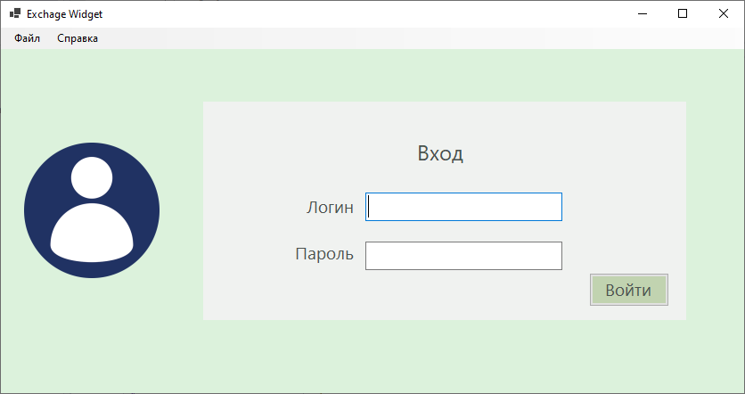
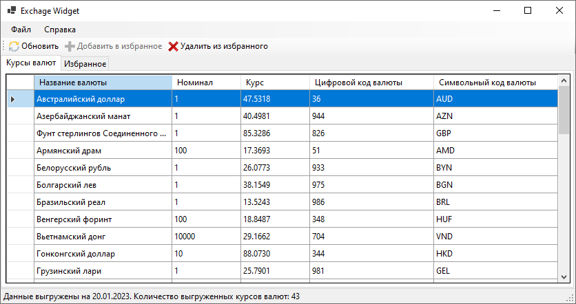

# Exchange Widget

Виджет для просмотра актуального курса валют ЦБ РФ

## Начало работы

Эти инструкции предоставят вам копию проекта и помогут запустить на вашем локальном компьютере для разработки и тестирования.

### Необходимые условия

Для запуска требуется установить .NET 6

### Установка

Собрать решение в Visual Studio 2022 или новее.

### Запуск

Для входа в приложение необходимы учётные даннные:
* Логин **admin**
* Пароль **admin123**

### Примеры работы программы

## Авторы

* **Барабанов Илья** - *ведущий разработчик* - [icepow-r](https://github.com/icepow-r/)

